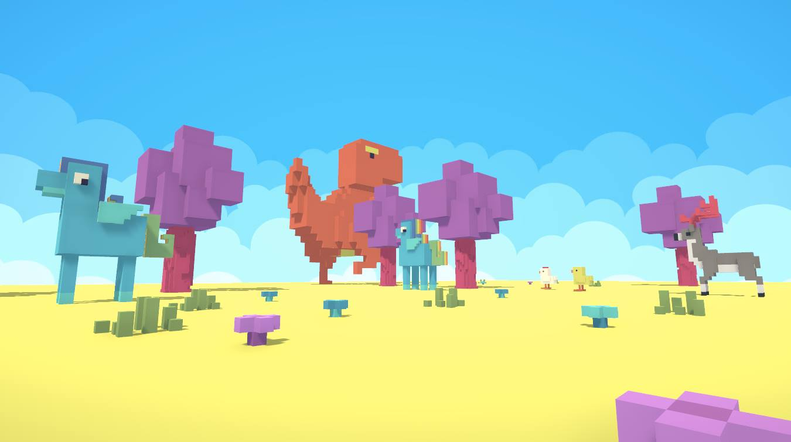
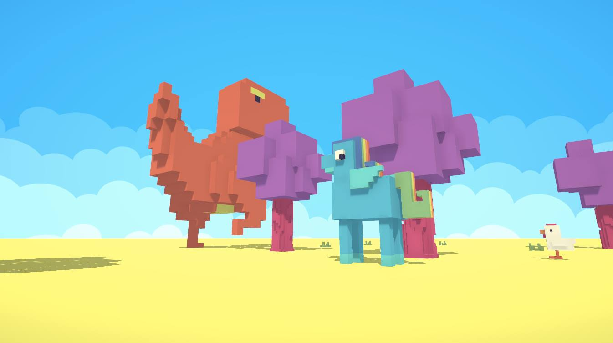
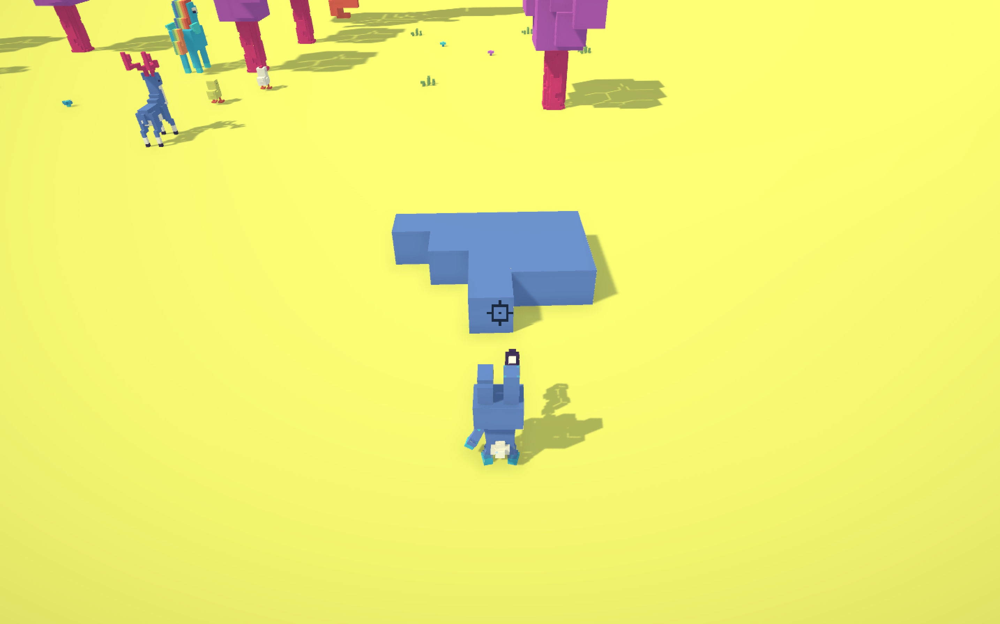
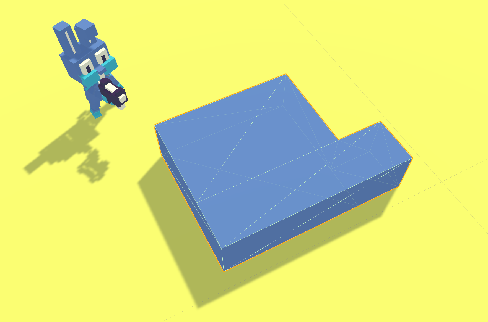
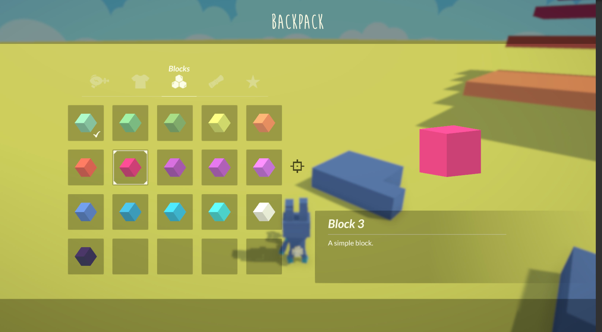

# Warfest

This is a voxel based game I've started a while ago.
It implements:

- A fully functional chunk system
- Culling of interior faces
- Greedy mesh algorithm (https://0fps.net/2012/06/30/meshing-in-a-minecraft-game/)
- A qbt loader, which is the file format generated but qbicle: http://www.minddesk.com/
- A beautiful inventory
- A start menu
- A world creation and selection menu
- A player with animations
- A 3rd person camera with care of walls
- And probably more stuff

I have also implemented infinite terrain generation using some different noises, but it is in another project. I could add it here if someone needs it.

A Youtube video:

## Controls

- WASD: to move
- Left click: to add a block
- Right click: to remove a block
- I: to open the inventory

If the cursor doesn't lock in the screen, open and close the inventory.

I suggest you to open the scene `Scene-01`.

## Note

If you have any question on this project or on how to make a voxel engine, or you want to make projects with me or you just want to talk to me, please contact me:
- FB Messenger: https://www.messenger.com/t/arnaudvalen
- Twitter (https://twitter.com/ArnaudValensi)

